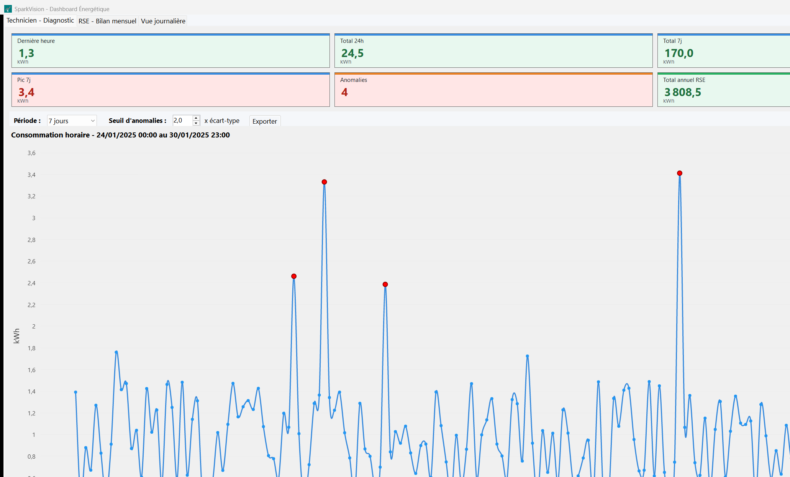
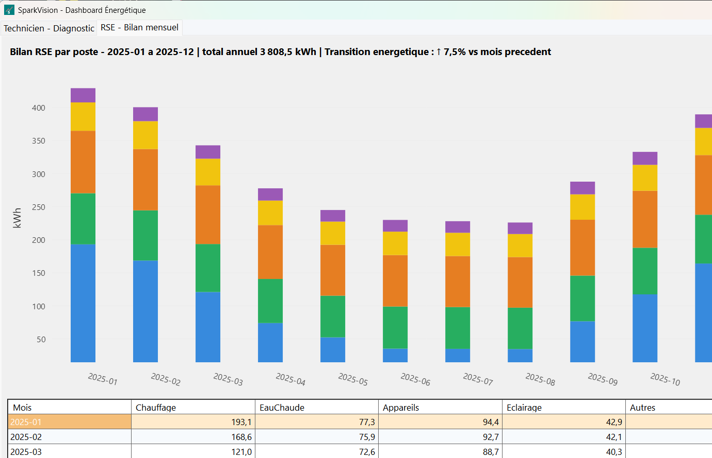
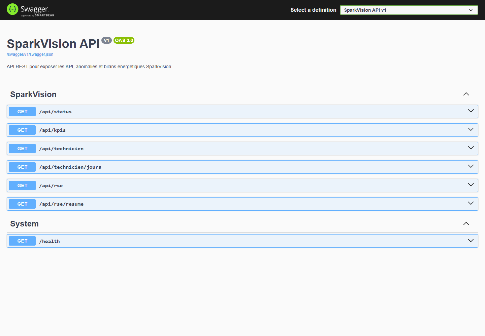

# SparkVision

Application Windows Forms .NET 10 pour analyser des donnees de consommation energetique. Les CSV sont importes automatiquement dans une base SQLite locale pour garder une demo simple et autonome.

Une API REST ASP.NET Core avec Swagger expose les memes KPI et bilans via une couche `SparkVision.Data` partagee. Une base PostgreSQL dockerisee est aussi fournie comme bonus d'industrialisation : elle importe les memes CSV, cree les tables SQL, les seuils KPI et des vues de demonstration.

## Apercu

### Dashboard technicien



### Bilan RSE



### API REST Swagger



## Contenu

- `SparkVision.WinForms` : application principale.
- `SparkVision.Api` : API REST ASP.NET Core avec Swagger.
- `SparkVision.Data` : couche partagee de chargement CSV, SQLite, logs et calculs metier.
- `docs` : captures d'ecran utilisees dans le README.
- `SparkVision.WinForms/Data/technician_dataset.csv` : releves horaires en kWh pour la vue technicien.
- `SparkVision.WinForms/Data/rse_dataset.csv` : bilan mensuel par poste pour la vue RSE.
- `sparkvision.db` : base SQLite creee automatiquement a cote de l'executable au premier lancement.
- `sparkvision.log` : journal applicatif genere automatiquement a cote de l'executable, avec purge au-dela de 500 lignes.
- `docker-compose.sql.yml` : API REST et PostgreSQL dockerises pour montrer l'automatisation SQL.
- `database/postgres` : schema, import CSV, vues KPI/RSE/anomalies et requetes demo.
- `scripts` : commandes PowerShell pour lancer la demo, l'API et la base Docker.

## Lancer l'application

```powershell
cd SparkVision
.\scripts\lancer-demo.ps1
```

Commande directe equivalente :

```powershell
$env:DOTNET_ROLL_FORWARD='Major'
dotnet run --project SparkVision.WinForms\SparkVision.WinForms.csproj
```

## Lancer l'API REST

```powershell
cd SparkVision
.\scripts\start-api.ps1
```

Swagger :

```text
http://127.0.0.1:5085/swagger
```

Endpoints principaux :

- `GET /health`
- `GET /api/status`
- `GET /api/kpis?seuil=2`
- `GET /api/technicien?jours=7&seuil=2`
- `GET /api/technicien/jours?jours=30`
- `GET /api/rse`
- `GET /api/rse/resume`

## Lancer la base SQL Docker

La base Docker est optionnelle : l'application WinForms continue de fonctionner avec SQLite meme si Docker n'est pas lance.

```powershell
cd SparkVision
.\scripts\start-docker-sql.ps1 -Reset
.\scripts\show-sql-demo.ps1
```

Le meme compose lance aussi l'API sur le port `8080` par defaut :

```text
http://127.0.0.1:8080/swagger
```

Connexion par defaut :

```text
Host=localhost;Port=5433;Database=sparkvision;Username=sparkvision_user;Password=SparkVision123!
```

Pour personnaliser les identifiants, copie `.env.example` vers `.env` puis modifie les valeurs.

## Interface

- Onglet `Technicien - Diagnostic` : KPI avec alertes couleur, filtre `1 jour / 7 jours / 30 jours`, seuil d'anomalie configurable, export CSV, courbe horaire avec infobulles et points rouges pour les anomalies.
- Onglet `RSE - Bilan mensuel` : total annuel, indicateur de transition energetique, barres empilees par mois, tableau detaille, ligne total en gras et surlignage du mois le plus consommateur.
- Onglet `Vue journaliere` : aggregation par jour sur les 30 derniers jours, total et moyenne journaliere.

## Architecture

```text
SparkVision.WinForms  -> SparkVision.Data -> CSV + SQLite locale
SparkVision.Api       -> SparkVision.Data -> CSV + SQLite locale
docker-compose.sql.yml -> API REST + PostgreSQL de demonstration SQL
```

Cette separation donne une version plus professionnelle : interface desktop, API REST documentee, couche metier partagee, logs applicatifs et demo Docker.


## Publication

```powershell
dotnet publish SparkVision.WinForms\SparkVision.WinForms.csproj -c Release -o publish/desktop -r win-x64 --self-contained true -p:PublishSingleFile=true
```
